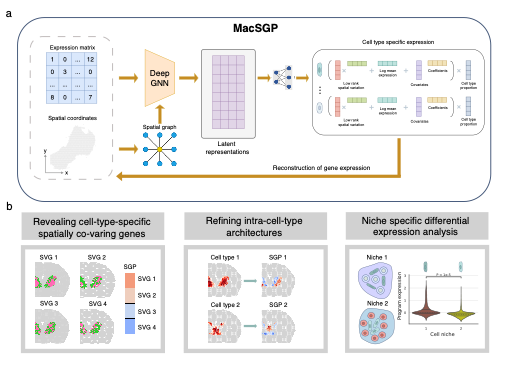

# MacSGP: Mapping Cell-Type-Specific Spatial Gene Programs Uncovers Tissue Architecture and Microenvironment Organization

<!-- badges: start -->
[](https://pypi.python.org/pypi/MacSGP/)


[](http://hits.dwyl.com/YangLabHKUST/MacSGP)


<!-- badges: end -->

## Introduction

`MacSGP` is a scalable statistical and computational approach for MApping Cell-type-specific Spatial Gene Programs (SGPs) in spatial transcriptomic (ST) data.

<figure>


</figure>

## Installation
It's recommended to create a virtual environment first.

```shell
$ conda create -n MacSGP python=3.11
$ conda activate MacSGP
```

### Installation through PyPI
MacSGP can be installed from PyPI:

```shell
$ pip install MacSGP
```

### Installation through GitHub
Alternatively, MacSGP can be downloaded from GitHub:
```shell
# Clone the repository
$ git clone https://github.com/YangLabHKUST/MacSGP.git
$ cd MacSGP
# Install the required packages
pip install -r requirements.txt
# Install MacSGP
$ python setup.py build
$ python setup.py install
```

## Real data analysis

The code for reproducing the real data analysis results presented in our paper are available on the tutorial website
(<https://macsgp-tutorial.readthedocs.io/>).

- [Visium adult mouse brain datasets containing 2 biological
  replicates](https://macsgp-tutorial.readthedocs.io/en/latest/analysis/mouse_brain/)
- [Visium kidney cancer dataset at the tumour-normal
  interface](https://mcube-tutorial.readthedocs.io/en/latest/analysis/kidney_cancer/)
- [Multiple human colorectal cancer datasets generated by different
  technologies](https://macsgp-tutorial.readthedocs.io/en/latest/analysis/CRC/)

## Reference

If you find `MacSGP` or any of the source code in this repository useful for your work, please cite:
> Mapping Cell-Type-Specific Spatial Gene Programs Uncovers Tissue Architecture and Microenvironment Organization.  
> Yeqin Zeng, Zhiwei Wang, Yuyao Liu, Yuheng Chen, Jiguang Wang, Hao Chen, and Can Yang.  
> Submitted, 2025.

## Development

The software is developed and maintained by [Yeqin Zeng](mailto:yzengbj@connect.ust.hk).

## Contact

Please feel free to contact [Yeqin Zeng](mailto:yzengbj@connect.ust.hk), [Zhiwei Wang](mailto:zhiwei.wang@connect.ust.hk), or [Prof. Can Yang](mailto:macyang@ust.hk) if any inquiries.
